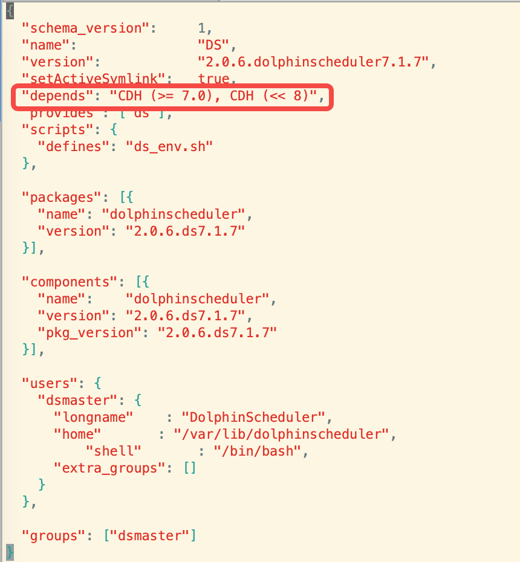
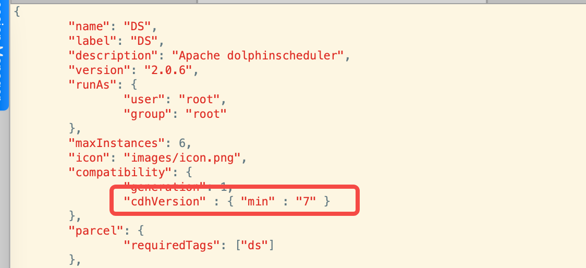

# dolphinscheduler-cdh-parcels
对dolphinscheduler-2.0.6进行打包，托管到CDH7.1.7集群  
dolphinscheduler2.0.6下载链接 https://dlcdn.apache.org/dolphinscheduler/2.0.6/apache-dolphinscheduler-2.0.6-bin.tar.gz

#### parcels包资源地址
链接: https://pan.baidu.com/s/12vAwc_E1ji7s86IeaNJnPQ  密码: 2kvo

#### 包目录结构
##### parcels
```text
dolphinscheduler-2.0.6
    ├── lib
    │   ├── dolphinscheduler
    ├── meta
    │   ├── parcel.json
    │   └── ds_env.sh
```

#### csd
```text
dolphinscheduler-2.0.6
    ├── descriptor
    │   └── service.sdl
    ├── images
    │   └── icon.png
    ├── scripts
    │   └── control.sh

```
#### parcel打包步骤
1、parcels打包
```shell script
tar -zcvf DS-2.0.6.dolphinscheduler7.1.7-el7.parcel DS-2.0.6.dolphinscheduler7.1.7
# 验证
java -jar validator.jar -f DS-2.0.6.dolphinscheduler7.1.7-el7.parcel
```
生成哈希文件
```shell script
sha1sum DS-2.0.6.dolphinscheduler7.1.7-el7.parcel
```
2、csd打包

```shell script
jar -cvf DS-2.0.6.jar csd/*
```

### CDH集群版本修改
1、修改parcel包中parcel.json文件depends属性


2、修改csd包中service.sdl文件cdhVersion属性

